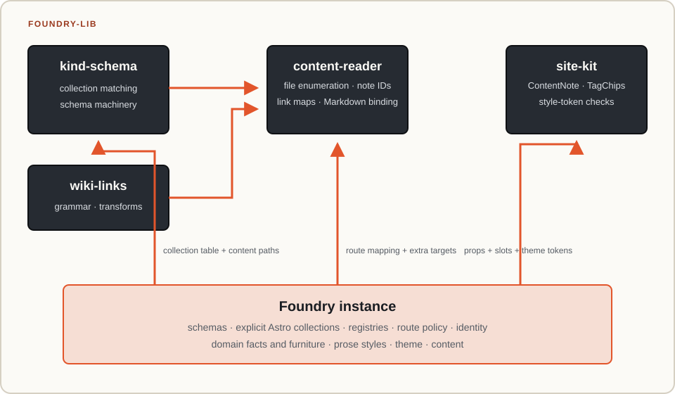
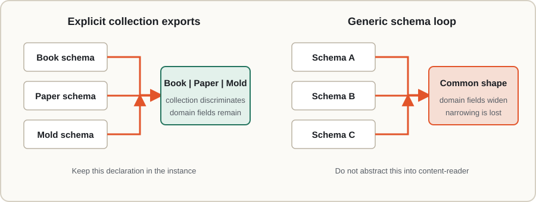
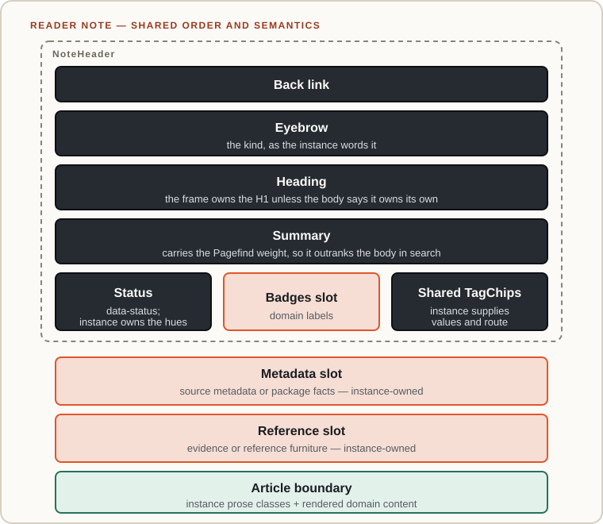

# Content-reader boundary

Three structurally different Foundries use the same content-reading mechanics. Galaxy Workflow
Foundry has a broad corpus whose CLI commands and Molds carry instance-specific second addresses.
Statistical Genomics Foundry has six routed collections and domain furniture for sources, evidence,
patterns, and molds. The TDA Bioinformatics Foundry begins with one Package collection and software
facts. Their content models should differ; their filesystem walk, link-map construction, note
frame, and tag markup should not.

## Ownership diagram



The instance binding is intentionally small:

```ts
export const contentReader = createContentReader({
  collections: COLLECTIONS,
  contentPath,
  aliases: (meta, id, collection) => galaxyAliases(meta),
  targetOf: (collection, id, meta) => {
    const target = { path: `${collection}/${id}` };
    return typeof meta?.summary === 'string' ? { ...target, title: meta.summary } : target;
  },
});
```

That is configuration because only the instance knows where a note should be addressed. Repeating
the filesystem walk, frontmatter parse, or wiki-link adapter locally would be infrastructure
duplication. Frontmatter is read only when `aliases` is supplied or `readFrontmatter` is explicitly
enabled, preserving the directory-only path for instances that do not need metadata.

The collection table is also the target boundary: companions beside a routed note are never
addressable unless their own collection row admits them. Primary collisions follow collection
property order with later collections winning; aliases cannot overwrite primaries.

The reader exposes two target views for different questions. `noteTargets()` preserves every
routed note and is the source for route/build coverage. `wikiLinkMap()` is an address map: primary
collisions may collapse, aliases add addresses, and explicit extra targets may override them.
Using the address map as a route inventory silently drops a real page whenever two note ids share
one primary slug.

## Why Astro collection exports stay local

The tempting final step is a package that maps an arbitrary collection catalog into Astro's
`collections` export. That loses useful type information. A mapped heterogeneous catalog becomes a
homogeneous array, widening each entry toward the common shape. Explicit `defineCollection` calls
preserve the discriminated union that lets a detail route narrow on `entry.collection` and read
kind-specific fields without casts.



This is not a domain-specific implementation leak. The local code declares the domain contract;
the package consumes the resulting collection table mechanically.

## Presentation boundary

`ContentNote` owns the order and semantics common to a note page. Slots admit local furniture:



A new domain field should normally become slot content in the instance. A new structural region
that two content sites need is evidence for extending `ContentNote`. The component never imports
an instance schema or switches on a domain kind.

## Release and adoption order

The shared packages release first. Instances then update to the published `content-reader` and
`site-kit` versions and regenerate their ordinary lockfiles. During cross-repository development,
local links may prove the integration, but those paths do not belong in an instance commit.
