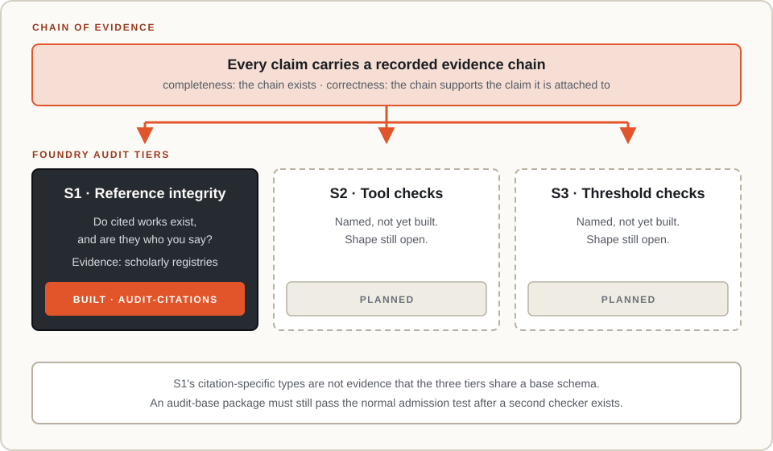
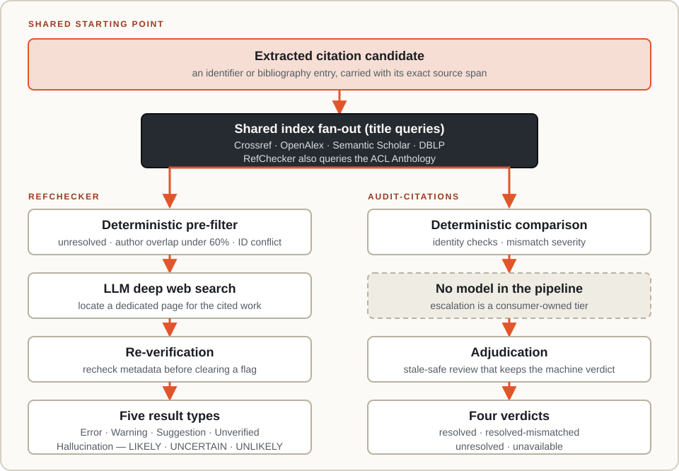

# Citation auditing and where we sit

Automated research writing made citation integrity a mechanical problem. This page places
`audit-citations` in the work that surrounds it: the framework it borrows its shape from, the tools
that solve the same problem differently, and the trade it makes that they do not.

## Claims need evidence chains

Google Research's [Science One framework](https://research.google/blog/science-one-framework-a-verifiable-autonomous-research-framework-via-chain-of-evidence/)
states the principle this package is built on. Every claim in a research artifact must carry a
recorded evidence chain — _completeness_ — and each chain must genuinely support the claim it is
attached to — _correctness_. A claim is not only a citation. It is also a reported number, a method
description, and a conclusion, and each binds to a different kind of evidence.

Science One audits four of them: score verification, specification violation, reference
verification, and method-code alignment. A Foundry has the same shape of problem, because a note
makes claims and those claims need chains. The tiers are S1 reference integrity, S2 tool checks, and
S3 threshold checks.

`audit-citations` is S1. It is first because it is the tier that resolves against public registries
without executing anything or evaluating a scientific claim — a DOI either names the work the
bibliography describes or it does not. S2 and S3 need execution records and measured outputs, so
they are named and unbuilt. That ordering is a statement about tractability, not about which claims
matter.

It also constrains what the S1 implementation is allowed to become. Citation-specific types are not
evidence that the three tiers share a base schema, and an `audit-base` package must still pass the
[normal admission test](concepts/shared-substrate.md) after a second checker exists.

## Why the tier needs a machine

The [CITADEL audit](https://retractionwatch.com/2026/05/07/one-in-277-pubmed-indexed-papers-in-2026-shows-fabricated-references-says-analysis/)
(Topaz et al., _The Lancet_, May 2026) scanned roughly 2.5 million PubMed-indexed papers and found
fabricated references in 2,810 of them. The trend is the finding: about one paper in 2,828 carried a
fabricated reference in 2023, one in 458 in 2025, and one in 277 in early 2026, with the sharpest
rise in mid-2024.

[Phantom References](https://arxiv.org/abs/2607.00738) (Russinovich, Siva Kumar, and Salem, 2026)
supplies the other half. Per-reference rates at ICLR, ICML, NeurIPS, and USENIX Security all sit
below 1%, which reads as negligible. Per-paper rates do not: in 2025 roughly one NeurIPS paper in
twenty carried at least two hallucinated references. Both figures describe camera-ready papers, so
peer review did not catch them.

Neither number is why this package exists. The first calibration run against real notes is:
[bio-topo-foundry#9](https://github.com/jmchilton/bio-topo-foundry/pull/9) audited 62 citation
candidates in existing TDA notes and found three bibliography entries whose DOI metadata pointed at
different papers than the surrounding text described. Hand-written notes, no generated prose, three
real defects.

## Three kinds of tool

The surrounding work splits into three groups that are easy to conflate.

**Output-grounding checkers** ask whether generated text follows from a source that was supplied to
it. [Amazon's RefChecker](https://arxiv.org/abs/2405.14486) decomposes a response into
`<subject, predicate, object>` claim-triplets and checks each against a reference document.

**Bibliography verifiers** ask whether a cited work exists and whether it is who the citation says
it is. [Russinovich's RefChecker](https://github.com/markrussinovich/refchecker) is the mature
example; CheckIfExist, HalluCiteChecker, Hallucinator, and HalRef solve neighbouring versions.

**Generation-time grounding** prevents fabrication at authoring time rather than detecting it
afterward. Science One's Problem Investigator builds citation graphs from retrieved full-text PDFs
so a citation can only come from a document the system actually holds, which took phantom references
to zero against baselines hallucinating up to 21%.

> **The two RefCheckers are unrelated.** `amazon-science/RefChecker` and
> `markrussinovich/refchecker` share a name, a problem domain, and nothing else. Only the second is
> comparable to this package.

Badalova and Mayr's [survey of the second group](https://arxiv.org/abs/2607.22693) is the honest
summary of its state: five tools tested, all useful as preliminary warnings, all limited by
reference extraction errors, incomplete metadata, and uneven database coverage. None can reach a
determination alone.

## RefChecker, compared

RefChecker is the reference point for S1, and it is a more complete product than this package: it
accepts PDF, LaTeX, BibTeX, DOCX, Markdown and more, ships a CLI, a web UI and desktop apps, and
scans an entire OpenReview venue in one command — at roughly four cents per paper, or about $157 for
the 3,703 papers and 221,281 references reported in Phantom References. `audit-citations` audits the
Markdown in one repository. These are not the same product and the comparison is not a ranking.

What is worth recording is how much of the design the two arrived at in common. Both fan a title
search across several indexes rather than trusting one, because coverage varies by venue, year, and
publication type: Crossref, OpenAlex, Semantic Scholar and DBLP here, those four plus the ACL
Anthology in RefChecker. Both keep identifier lookups out of that fan-out, because an identifier
reads a registry that is authoritative for it. Both define the failure at the level of identity — a
work that does not exist, or an author list substantially unlike the real one — and both treat a
differing year as a warning rather than a dispute about identity.

The sharpest agreement is a number. RefChecker escalates a reference when fewer than 60% of its
authors match, and applies that test only to references with three or more authors. This package
uses an author-overlap threshold of 0.6 and abstains below three compared names unless every name
matches. Two designs reaching the same threshold and the same abstention floor is better evidence
that both are calibrated correctly than either could produce alone.

They diverge in three places, each a trade rather than a gap.

**Screening against regression.** RefChecker screens a paper once, before publication, and a venue
once, before a deadline. This package is built to be re-run over the same corpus, which changes what
a result means: a citation that resolved last month and does not resolve today is itself a signal.
It supplies the ingredients — a committed evidence cache, a corpus digest, a retained candidate
snapshot — and a consuming repository decides what to compare and what to gate on.

**Recall against reproducibility.** RefChecker escalates suspicious references to an LLM-driven deep
web search, constrained to finding a dedicated page for the cited work rather than another paper
repeating the citation. That recovers works no index carries. This package does not, because a model
in the pipeline makes a run irreproducible, and a run that cannot be replayed cannot be compared
against. The tier is deliberately pushed above the package boundary. The gain is measurable rather
than theoretical: bio-topo-foundry#9 replayed its audit from an isolated clean clone and reproduced
the Markdown reports byte-for-byte, with the JSON findings identical apart from run-specific
timestamp and revision fields.

**Application against library.** RefChecker is something you run. This package is something a
repository drives, which is why acceptance policy, source layout, artifact vocabulary, and the
request budget all stay with the consumer.

## The cost of recall

Badalova and Mayr tested the five bibliography verifiers on 104 references, 20 of them problematic.
RefChecker found all 20 and missed none — the best detection result in the study — and also produced
48 false positives. It is not an outlier: the study's highest false-positive count, 62, belongs to a
tool that caught 15 of the 20. But that is the shape of a recall-first design, and the cost does not
land on the tool. It lands on whoever reads the spurious flags.

Four decisions in this package are answers to that number.

**State is not verdict.** Provider evidence is `resolved`, `unresolved`, or `unavailable`, and the
third exists so that infrastructure failure is never reported as a missing work. A provider that
could not be reached leaves a citation `unavailable` rather than borrowing another provider's miss.

**Severity separates drift from dispute.** Only an `error` — a title describing something else, a
first author who is not the one the record names, two identifiers resolving to different works —
makes a citation `resolved-mismatched`. A differing year is a `warning`, so a preprint that later
acquired a journal year stays out of the queue that holds a fabricated author.

**Author comparison abstains.** Two author lists are compared only as deep as the shorter one
reaches, because a provider storing three of thirty authors is not evidence of fabrication, and
below three compared names the check abstains unless every name matches.

**Thresholds are asymmetric on purpose.** Search accepts a title loosely, because a close but wrong
hit is handed to the comparison rather than trusted. Comparison disputes identity strictly, because
falling below that line puts a person in the queue.

Review is bounded the same way: an adjudication carries the digest of the text it reviewed and is
rejected if that text changed, and the three manual classifications preserve the machine verdict
beside the human one instead of overwriting it.

None of this has been measured against that benchmark. The four are answers to the number, not
evidence about it — the only corpus this package has been calibrated on is 62 hand-written
references in which no citation was fabricated at all.

## What this package does not claim

The extractor reads modern arXiv IDs, five-to-nine digit PMID and PMCID forms, DOI strings,
allowlisted `.html` scholarly pages, and single-line numbered bibliography entries. Old-style arXiv
IDs, shorter historical PMIDs, wrapped or bulleted bibliographies, and general scholarly URLs are
outside the grammar, and free-form author–year prose is counted as a diagnostic rather than promoted
to a candidate.

Those limits are reported rather than hidden. The scan records every non-blank line inside a
reference section that produced no candidate, and the report states extraction coverage beside the
verdict counts, as a lower bound. This answers the extraction failure Badalova and Mayr found in all
five tools they tested: a resolution rate describes only the citations the extractor could read, and
a tool that does not say how much it read is reporting a number nobody can size.

The package is experimental and has one adopter. Its shape is evidence about one corpus, and the
first structurally different adopter is expected to falsify part of it.

## Sources

- [Science One: a verifiable autonomous research framework via chain of evidence](https://research.google/blog/science-one-framework-a-verifiable-autonomous-research-framework-via-chain-of-evidence/) — Google Research
- [Phantom References: Hallucinated Citations That Survive Peer Review at Top-Tier Conferences](https://arxiv.org/abs/2607.00738) — Russinovich, Siva Kumar, Salem, 2026
- [Detecting Hallucinated and Suspicious Citations: What Current Tools Can and Cannot Do](https://arxiv.org/abs/2607.22693) — Badalova and Mayr, 2026
- [RefChecker: Reference-based Fine-grained Hallucination Checker](https://arxiv.org/abs/2405.14486) — Amazon Science, 2024
- [markrussinovich/refchecker](https://github.com/markrussinovich/refchecker) and [amazon-science/RefChecker](https://github.com/amazon-science/RefChecker)
- CITADEL fabricated-citation audit, Topaz et al., _The Lancet_, May 2026, [summarized by Retraction Watch](https://retractionwatch.com/2026/05/07/one-in-277-pubmed-indexed-papers-in-2026-shows-fabricated-references-says-analysis/)
- [bio-topo-foundry#9](https://github.com/jmchilton/bio-topo-foundry/pull/9) — the first reviewed calibration run

For the implementation these choices produce, see the
[citation audit architecture](architecture/audit-citations.md).
